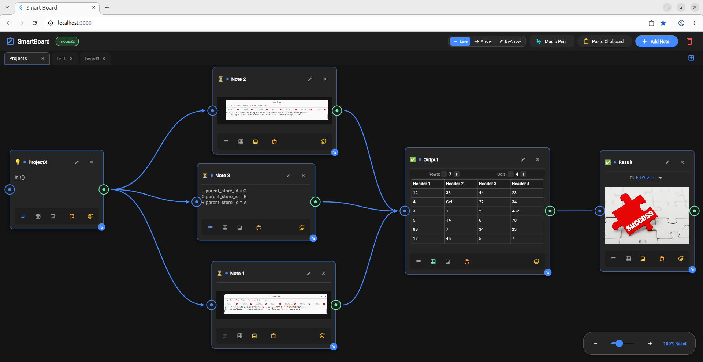
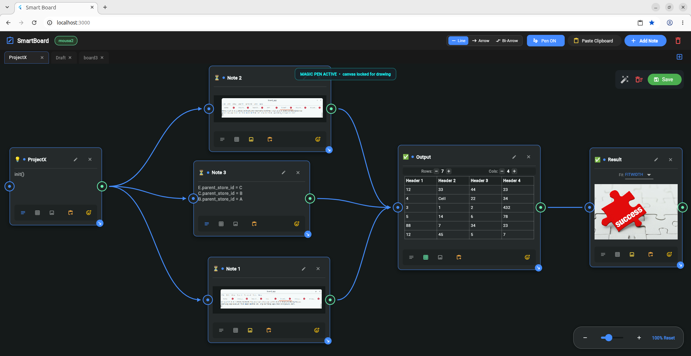

# Smart Board

> A hands-on engineering project exploring Flutter and Flutter Web through the development of an infinite visual workspace.



**Smart Board** is a developer-first infinite canvas for capturing, organizing, connecting, and annotating ideas, code, tables, images, and visual notes.

Instead of forcing users into rigid node types, Smart Board uses a **Unified Note Architecture** where every item is a Note that can contain different types of content and connect visually to other Notes.

The idea is simple:

> **Capture something → put it on the canvas → organize it → connect it → build on it.**

## Project Purpose

Smart Board is primarily a **hands-on learning and engineering project** built to deepen practical experience with **Flutter, Flutter Web, Dart, and application architecture**.

Rather than building isolated tutorials or small demo applications, the project uses a single evolving application to explore real frontend challenges such as:

* State management
* Interactive canvas development
* Dragging and resizing
* Zooming and panning
* Gesture handling
* Clipboard integration
* Dynamic content rendering
* Visual connections and graph-like interactions
* Freehand drawing
* Client-side application architecture
* Communication with a REST backend

The project is intentionally being developed **incrementally and phase by phase**. Some areas are simple or incomplete by design while the underlying concepts are being explored and implemented.

The goal is not to present Smart Board as a finished commercial product, but to build a real application while learning how to design and evolve it properly.

## Current Features

### Infinite Canvas

* Flexible canvas workspace
* Pan and zoom
* Dynamic Note positioning
* Note dragging
* Note resizing
* Multiple boards/tabs in the workspace

### Unified Notes

Every canvas item is represented as a Note.

Notes currently support:

* Automatic serial titles (`Note 1`, `Note 2`, `Note 3`, ...)
* Editable titles
* Status badges / emojis
* Text content
* Interactive table grids
* Images
* Image fit modes
* Clipboard-based content insertion

### Clipboard Integration

Smart Board is designed around quickly bringing information into the canvas.

* Paste text from the system clipboard
* Paste images/screenshots
* Paste image URLs and data URLs
* Paste tables and structured text
* Paste directly into a new Note
* Paste into an existing Note

### Visual Connections

Notes can be connected to represent relationships, dependencies, workflows, or data flow.

* Click-based connection creation
* Cubic Bezier connection curves
* Directional arrows
* Bi-directional connections
* Self-link protection
* Duplicate-link protection
* Interactive connection removal

Example:

```text
Note A ─────────→ Note B
Note C ←────────→ Note D
```

### Magic Pen

Smart Board also provides a freehand drawing mode for quick annotations and sketches.



Current capabilities include:

* Freehand drawing
* Responsive pointer-based strokes
* Canvas interaction lock while drawing
* Visual indication that drawing mode is active
* Eraser / rubber functionality
* Clear drawings
* Save drawing state

The drawing mode intentionally provides a visual indication when the canvas is locked so the user understands why normal canvas interaction is temporarily disabled.

## Frontend Technology

Smart Board is currently built with:

* **Flutter**
* **Dart**
* **Flutter Web**
* **Provider** for state management

Key packages include:

* `provider`
* `uuid`
* `http`
* `pasteboard`
* `flutter_html`

## Frontend Structure

```text
lib/
├── models/
│   ├── canvas_item.dart
│   ├── connection.dart
│   └── drawing_point.dart
│
├── providers/
│   └── board_provider.dart
│
├── services/
│   ├── api_service.dart
│   └── clipboard_service.dart
│
└── views/
    ├── auth/
    │   └── auth_dialog.dart
    │
    └── canvas/
        ├── canvas_screen.dart
        ├── interactive_board.dart
        ├── cards/
        └── widgets/
```

## Backend

The Spring Boot backend is maintained as a **separate project** and is not part of this repository.

This Flutter application communicates with the backend through its REST API for features such as authentication and persistent workspace data.

The frontend and backend are intentionally kept as separate projects.

## Running Locally

Make sure Flutter is installed and configured for Web development.

Install dependencies:

```bash
flutter pub get
```

Run the application in Chrome:

```bash
flutter run -d chrome --web-port=3000
```

The development application runs at:

```text
http://localhost:3000
```

## Next Phase

The next development phase will focus on improving Note usability and beginning the workspace/navigation layer.

### Note Improvements

#### Highlight Note

Allow Notes to be visually highlighted with:

* Red
* Green
* Custom color

#### Expand / Collapse Note

Add a minimize button beside the remove button.

When minimized:

* Hide the entire Note body
* Hide the Note footer
* Keep the Note header visible
* Allow the Note to be restored with the same control

This will make it easier to manage large canvases containing many Notes.

### Navigation & Workspace

Begin building the main navigation menu with:

* **My Profile**
* **My Boards**

  * Mine
  * Shared With Me
* **Invite Others**

This will establish the foundation for moving from the current canvas-focused experience toward a proper multi-board workspace.

## Roadmap

```text
[x] Unified Note Architecture
[x] Infinite Canvas
[x] Pan & Zoom
[x] Note Dragging
[x] Note Resizing
[x] Editable Note Titles
[x] Text Notes
[x] Table Notes
[x] Image Notes
[x] Clipboard Integration
[x] Visual Note Connections
[x] Directional Connections
[x] Bi-directional Connections
[x] Magic Pen
[x] Authentication UI

[ ] Note Highlighting
[ ] Note Expand / Collapse
[ ] Navigation Menu
[ ] My Profile
[ ] My Boards
[ ] Shared With Me
[ ] Invite Others
[ ] Improved Board Persistence
[ ] Canvas Export
[ ] Search & Filtering
[ ] Multi-Select & Grouping
[ ] Real-Time Collaboration
```

## Development Status

**Status: Active Development**

Smart Board is being built incrementally as a practical Flutter engineering project.

The current milestone establishes the core canvas interaction model: Notes, multiple content types, visual connections, clipboard integration, and freehand annotation.

Future phases will build on this foundation with stronger workspace management, persistence, collaboration, and productivity features.

## Vision

Smart Board is built around one simple idea:

> **Your workspace should adapt to your thoughts, not the other way around.**

The long-term direction is a flexible visual workspace that can sit between the browser, IDE, documentation, and AI tools — allowing ideas and information to be captured quickly and then organized visually instead of being forced into a rigid structure.

